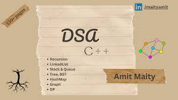

<h1>Hello World!! Learn DSA with deva@github27</h1>
<quote><h3>Intro : 🌐🌐➡️ Myself Debayan Das, an aspiring Full-Stack developer mainly interested in guiding users to Design Websites</h3></quote>
<h2><b>: : Lets Come to the point : :  So What do you know about DSA?</b></h2>
</img>
 <big>#D - Data  
#S - Structure  
#A - Algorithm  </big>
<h2><b>Components of @DSA : </b> Frontend Developers Vs Backend Developer ⤵️</h2>
</img>
# DSa
# DataStructure
